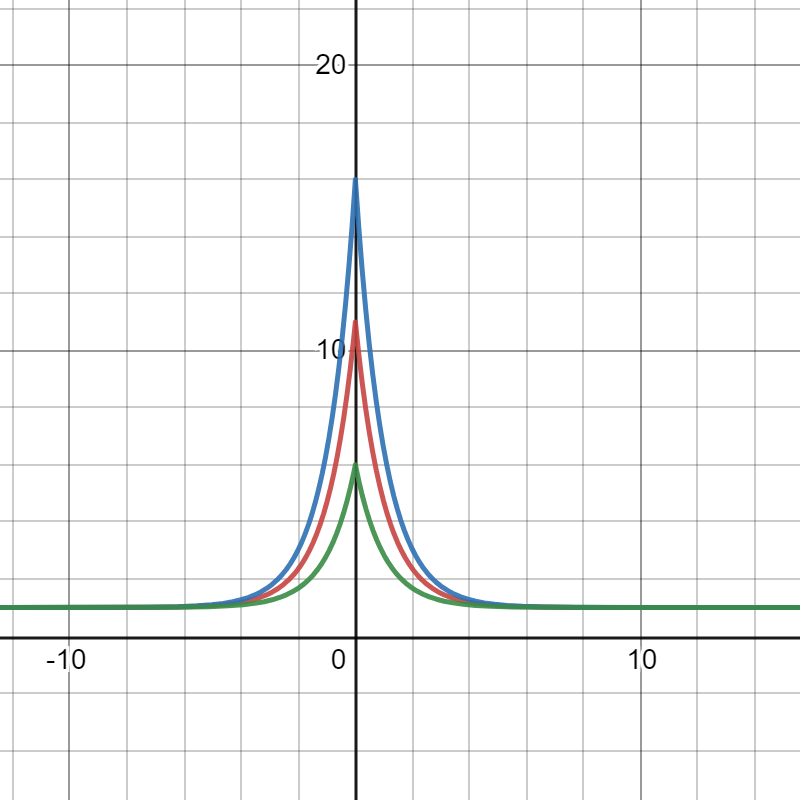
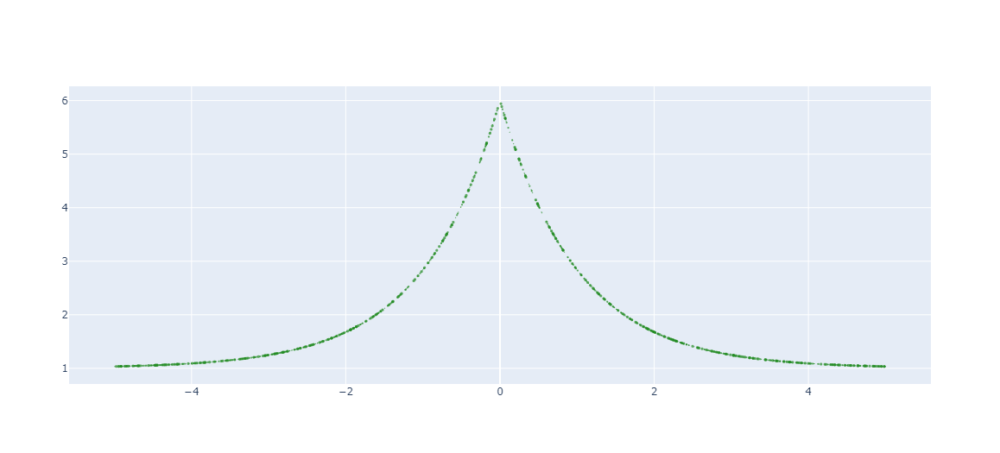
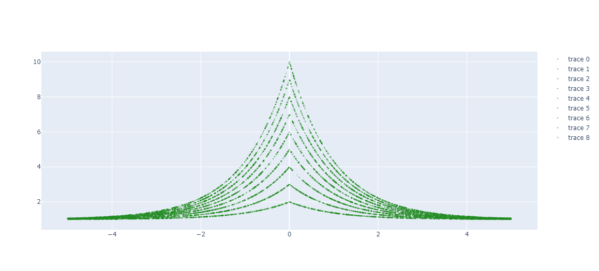
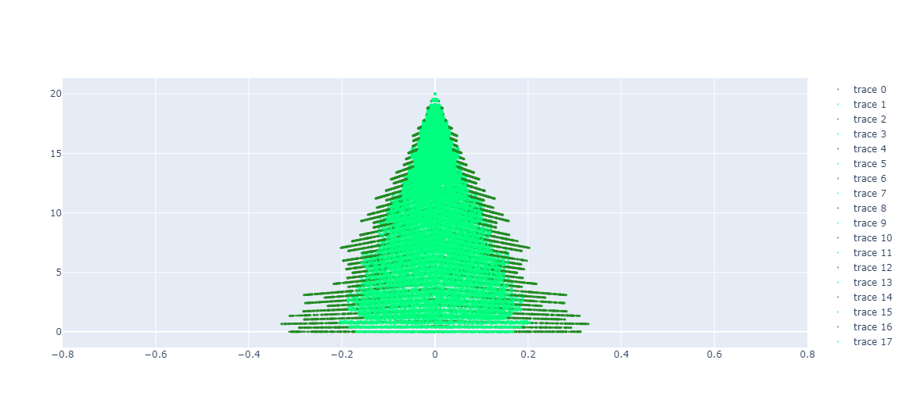
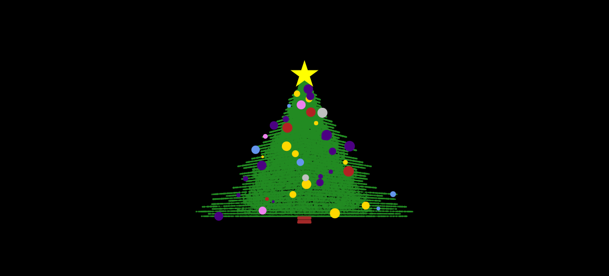

# How to Draw a Christmas Tree with Python and Plotly
[](https://github.com/gcgrossi/xmas_tree/blob/main/xmas_tree.ipynb)
[](https://colab.research.google.com/drive/1WskeMfLA8P0xbzzQwvrdapp3Z4YB89GW?usp=sharing)

The Christmas version of the episodes regarding my advendtures in the world of Data Science and Tech is focused on art: the Art of drawing something using some basic math, some for loops and a pinch of creativity. Today I'm going to draw a Christmas tree.

If I was a very cool Data Scientist or a Computer Vision specialist I would have probably trained a GAN and tried to generate some aproximation of thousand of example images of trees (something similar to 'this person does not exist').

But I'm a simple phyisicist coming from the old school of solving differential equations with pen and paper. So my version will be a mathematical version of a Christmas tree. 

I will use the function

$y = h+\frac{m}{e^{\lvert x \rvert}}$

Let's have a look at this function.



Different values of $m$ will give different slope to the exponential function. It will also set the intersection with the y-axis equal to $m$. The parameter $h$ will shift the entire distribution by the same factor. 

Playing with these parameters will help us drawing our tree. Moreover, we can add some animations by using a Flask server that will serve a front-end html page. A Javascript AJAX call to the server will power the updates of the plot by using the Javascript version of the famous drawing library plotly.

Let's start! But before:

## Disclaimers

1. The following is just a visualisation game, useful to teach some math and basic python. It is not meant to be used outside these scopes.

2. Running the script is costly and not optimized. I didn't much care about time optmisation here. The resulting experience may therefore be slow/resource consuming.

## Imports

```python 
import math
import random
import numpy as np
import plotly.graph_objects as go
```

## Branches

Let's draw a branch. We can achieve this by using our magic formula for a certain value of $h$ and $m$. To make things look more 'natural', we will drawn n random points (that we will assimilate to leafs) with random size.

```python 
# n leafs if the number of points in each branch
nleafs= 1000
max_leaf_size = 3

xs,ys,ls = [],[],[]
for leaf in range(0,nleafs): 
                
  # draw a random number for each element x corrdinate
  x = random.uniform(-abs(5),abs(5))
  # use our magic formula to obtain the y coordinate
  y = 1+(5/math.exp(abs(x)))

  # append a list with the coordinates
  # assign also a variable size to each point
  xs.append(x)
  ys.append(y)
  ls.append(random.randint(1,max_leaf_size))

fig = go.Figure()
fig.add_trace(go.Scatter(x=xs, y=ys ,mode='markers', marker=dict(color='forestgreen', size=ls, line=dict(width=0))))
fig.show()
```



### Drawing many branches

We can draw many branches by repeating the procedure for different values of the parameter $m$.

```python
# n leafs if the number of points in each branch
nleafs= 1000
max_leaf_size = 3
branch_step = 1
nbranches = 10.0

# we create a series of 'master' lists with
# x coordinates of the branch and the shade
# y coordinate of the branch and the size of each point ('leaf')
xtree,ytree,leaf_size = [],[],[]

# we create a seriers of values used to "represent"
# a branch of the tree. They will be used for 
# furter calculations
branch = np.arange(1.0,nbranches,branch_step)

for b in branch:
  xs,ys,ls = [],[],[]
  for leaf in range(0,nleafs): 
                
    # draw a random number for each element x corrdinate
    x = random.uniform(-abs(5),abs(5))
    # use our magic formula to obtain the y coordinate
    y = 1+(b/math.exp(abs(x)))

    # append a list with the coordinates
    # assign also a variable size to each point
    xs.append(x)
    ys.append(y)
    ls.append(random.randint(1,max_leaf_size))
  
  # for each branch append the corresponding branch points
  # to the master list.
  xtree.append(xs)
  ytree.append(ys)
  leaf_size.append(ls)


fig = go.Figure()
for i,x in enumerate(xtree): fig.add_trace(go.Scatter(x=x, y=ytree[i] ,mode='markers', marker=dict(color='forestgreen', size=ls, line=dict(width=0))))
fig.show()
```



Not yet the figure we would like to see, they don't have the aspect of branches of a tree! But if you look closer you will see that we are not so far from a good result. The only thing that is missing is limiting the x range, $[-xmax,xmax]$, of each branch and having a slower slope. We want a small x-range and high slope for the top branches and higher x-range and lower slope for the bottom branches.

We will use linearly decreasing values for $m$ and $xmax$ as a function of the branch

$m = \frac{(b-b_1)*(m_2-m_1)}{(b_2-b_1)} + m_1$ 

$xmax = \frac{(b-b_1)*(x_2-x_1)}{(b_2-b_1)} + x_1$ 

<br>
We can chose in example:

$b \in [1,10] , m \in [0,20], xmax \in [0,0.3]$ 

```python
# n leafs if the number of points in each branch
nleafs= 1000
max_leaf_size = 3
branch_step = 1/5
nbranches = 10.0

# we create a series of 'master' lists with
# x coordinates of the branch and the shade
# y coordinate of the branch and the size of each point ('leaf')
xtree, xshade, ytree,leaf_size = [],[],[],[]

# we initialize the values 
# x1,x2: bottom and top (of the three) maximum x coordinate of a branch
# x3,x4: bottom and top (of the three) maximum x coordinate of the branch shade
# m1,m2: bottom and top (of the three) slope of the branch
x1,x2 = 0.3,0
x3,x4 = 0.2,0
m1,m2 = 0,20

# we create a seriers of values used to "represent"
# a branch of the tree. They will be used for 
# furter calculations
branch = np.arange(1.0,nbranches,branch_step)

for b in branch:
  xs,xsh,ys,ls = [],[],[],[]

  # in order to create an effect of branches with length
  # that decreases along the tree (from top to bottom)
  # we linearly decrease the maximum x coordinate of the branch
  xtop = (b-branch[0])*(x2-x1)/(branch[-1]-branch[0])+x1
            
  # in order to have a less static cutoff we add to this max value
  # a random number that is a fraction of xtop. (A gaussian blurring
  # may also be applied, but I didn't test it).
  xtop = xtop+random.uniform(-abs(xtop),abs(xtop))/5

  # same procedure is applied to the shade
  shade = (b-branch[0])*(x4-x3)/(branch[-1]-branch[0])+x3
  shade = shade+random.uniform(-abs(shade),abs(shade))/5

  # also the slope of the branch is changed linearly along the tree.
  # this gives the effect of having a flat base to the tree
  # with more spiked top.
  m  = (b-branch[0])*(m2-m1)/(branch[-1]-branch[0])+m1

  for leaf in range(0,nleafs): 
                
    # draw a random number for each element x corrdinate
    x = random.uniform(-abs(xtop),abs(xtop))
    s = random.uniform(-abs(shade),abs(shade))
    # use our magic formula to obtain the y coordinate
    y = (m/math.exp(abs(x)))

    # append a list with the coordinates
    # assign also a variable size to each point
    xs.append(x)
    xsh.append(s)
    ys.append(y)
    ls.append(random.randint(1,max_leaf_size))
  
  # for each branch append the corresponding branch points
  # to the master list.
  xtree.append(xs)
  xshade.append(xsh)
  ytree.append(ys)
  leaf_size.append(ls)

fig = go.Figure()
for i,x in enumerate(xtree): 
  fig.add_trace(go.Scatter(x=x, y=ytree[i] ,mode='markers', marker=dict(color='forestgreen', size=leaf_size[i], line=dict(width=0))))
  fig.add_trace(go.Scatter(x=xshade[i], y=ytree[i] ,mode='markers', marker=dict(color='springgreen', size=leaf_size[i], line=dict(width=0))))
fig.update_xaxes(range=[-0.8,0.8])
fig.show()
```



As you can see, with the same principle we also added a 'shading effect' and colored with a different tone. You can try different colors and see if you obtain a better effect.

## Adding the log

we can add the log at the bottom in a very simple way. We create a series of vertical lines densed packed together

```python
# we create the torso of the tree by
# creating a series of vertical lines
ytorso = list(np.arange(m1-1,m1,0.1))
xrange,xstep,xtorso = 0.02,0.001,[]
for t in np.arange(-xrange,xrange,xstep):
    x=[t for _ in ytorso]
    xtorso.append(x)
```

## Adding the balls and the star at the top

We will add the balls by picking a random point in the tree and assigning a point in the same x,y coordinates with variable size and color.

```python
max_ball_size = 20
nballs = 1

# a list of plotly colors for the balls
colors = ['firebrick','cornflowerblue','indigo','indigo','silver','gold','violet']
    
ballsx,ballsy,size_ball,c = [],[],[],[]
    
# we loop over the master list and for each set of 
# coordinates and each we draw nballs random coordinate 
for X,Y in zip(xtree,ytree):
    for i in range(0,nballs):
        b = random.randint(0,len(X)-1)

        # if the coordinate is a little bit less than the top
        # (we want some space to put the star to the top)
        # we append the ball coordinate, the size and the
        # color (drawn randomly from the color list)
        if Y[b] < m2-2:
            ballsx.append(X[b])
            ballsy.append(Y[b])
            size_ball.append(random.randint(5,max_ball_size))
            c.append(colors[random.randint(0,len(colors)-1)])
```

## Drawing the final result

```python
fig = go.Figure()

# drawing the branches
for i,x in enumerate(xtree): 
  fig.add_trace(go.Scatter(x=x, y=ytree[i] ,mode='markers', marker=dict(color='forestgreen', size=ls, line=dict(width=0))))
  fig.add_trace(go.Scatter(x=xshade[i], y=ytree[i] ,mode='markers', marker=dict(color='forestgreen', size=ls, line=dict(width=0))))

# drawing the log
for i,x in enumerate(xtorso): fig.add_trace(go.Scatter(x=x, y=ytorso ,mode='markers', marker=dict(color='brown', size=leaf_size[0], line=dict(width=0))))
# drawing the log
for i,x in enumerate(ballsx): fig.add_trace(go.Scatter(x=[x], y=[ballsy[i]] ,mode='markers', marker=dict(color=c[i], size=size_ball[i], line=dict(width=0))))
# drawing the star
fig.add_trace(go.Scatter(x=[0], y=[m2] ,mode='markers', marker=dict(symbol ='star', color='yellow', size=40, line=dict(width=0))))

fig.layout = {'title' : '',
              'showlegend':False, 
               'xaxis': {'range':[-0.8,0.8], 'title' : '','linecolor':'black','showticklabels':False, 'showgrid': False, 'zeroline':False},
               'yaxis': { 'title' : '','linecolor':'black','showticklabels':False, 'showgrid': False, 'zeroline':False},
               'paper_bgcolor':'black','plot_bgcolor':'black'}

fig.show()
```


## Adding the light animation

In order to add some light animation we are going to deploy this tree on a local Flask server. The server is used as a backend to an html page that will:

1. Fetch the data for drawing the tree by making a request to one back-end endpoint.
2. Draw the tree using the Javascript version of plotly.
3. Fetch the data for drawing the lights and update the tree at constant interval of time.

All the code can be found in the Github repository. Here we are going to summarize the main three steps.

## Deploying to a Flask server

This is implemented in ```main.py``` by the following trunk of code:

```python
from flask import Flask
from flask import render_template
import tree
import json

app = Flask(__name__)

@app.route('/')
def index():
    # route that renders the home page html
    return render_template('index.html')

@app.route('/getdata', methods=['GET'])
def getdata():
    # this is an API that
    # fetches the information to construct the tree
    # of the tree. Wen called with AJAX return a json with the info
    dicttree = tree.get_tree()
    return json.dumps(dicttree,separators=(',', ':'))

@app.route('/light', methods=['GET'])
def light():
    # this is an API that
    # draws a random row of the dataframes representing the lights
    # of the tree. Wen called with AJAX return a json with the info
    dict_light= {}
    i = random.randint(0,len(app.config['xl']))    
    dict_light['x'] = app.config['xl'].loc[i,:].to_list()
    dict_light['y'] = app.config['yl'].loc[i,:].to_list()
    dict_light['size'] = app.config['xs'].loc[i,:].to_list()

    return json.dumps(dict_light,separators=(',', ':'))

if __name__ == '__main__':
    # before running the app we assign the dataframes with the
    # coordinates of the lights as a global app variables
    app.config['xl'],app.config['yl'],app.config['xs'] = tree.get_lights()
    # we run the app
    app.run(host='127.0.0.1', port=8080, debug=True)
```

There are mainly three routes:

```python
@app.route('/getdata', methods=['GET'])
def getdata():

.
.

@app.route('/light', methods=['GET'])
def light():
```

These two routes are endpoints tha call the functions in ```tree.py``` and fetch the information to draw the tree, returning the information in a json format. 

```getdata()``` uses the function ```get_tree()```, that has the same code we discussed before. ```light()``` takes the info from three DataFrames that we fill at server startup and we store as state object for the app. The dataframes are constructed using the function ```get_lights()```.

The logic behind the lights is the same as for the leafw of the three. In this case the ```nleaf``` parameter is replaced by ```nlights``` parameter, and we construct a set of 100 different light positions and sizes that we store as rows in the output DataFrames. Every time we need a set of lights we will just pick a random row from the DatFrame and return it. If we repeat every n seconds and draw each set of light removing the precedent, we will have a nice light animation.

## Building the front-end 

The main part of the front-end is stored in ```index.html```. The information for drawing the tree is obtained at startup by the following code.

```javascript
document.addEventListener('DOMContentLoaded', function () {
        // generate all the drawing at document load
        getGenerateData();
    });
    
  function getGenerateData() {
        // make an AJAX call to the backend
        // obtain the tree data in JSON format
        // and call the generateChart function if
        // response id successfull
        console.log('performing AJAX request ... ')

        $.ajax({
            url: '/getdata',
            type: 'GET',
            success: function (response) {
                console.log('Success');
                console.log(JSON.parse(response))
                generateCharts(JSON.parse(response));
            },
            error: function (response) {
                console.log('Error');
                console.log(JSON.parse(response));
            }
        });
    }

```

The most important part is the AJAX request in ```getGenerateData()``` that is responsible of the communication with the back-end


[Plotly Linkedin Post](https://www.linkedin.com/feed/update/urn:li:activity:6881628600831918080/)
